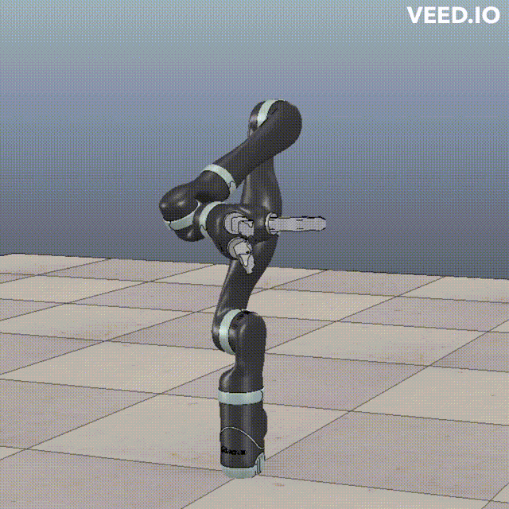
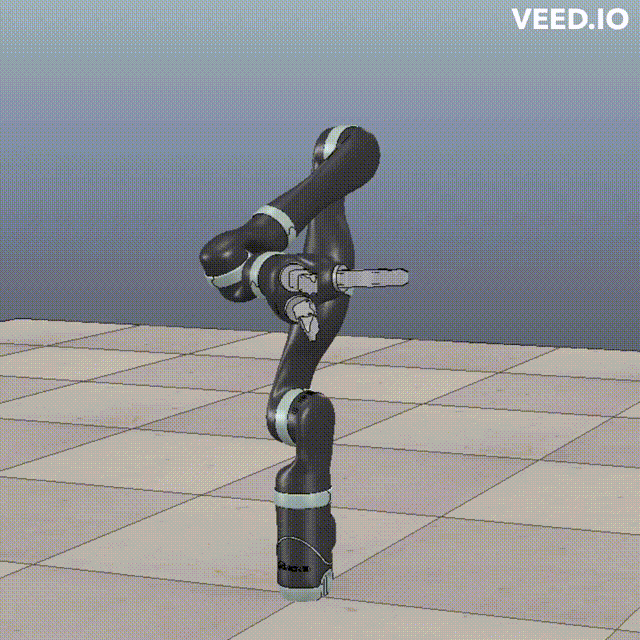
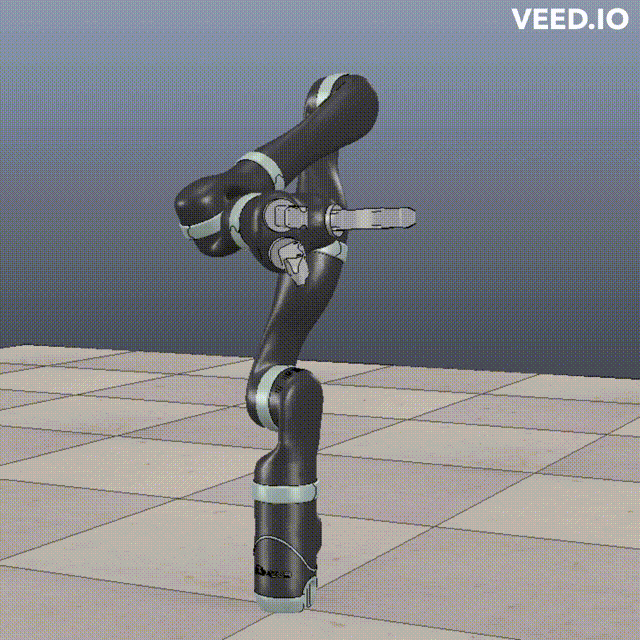
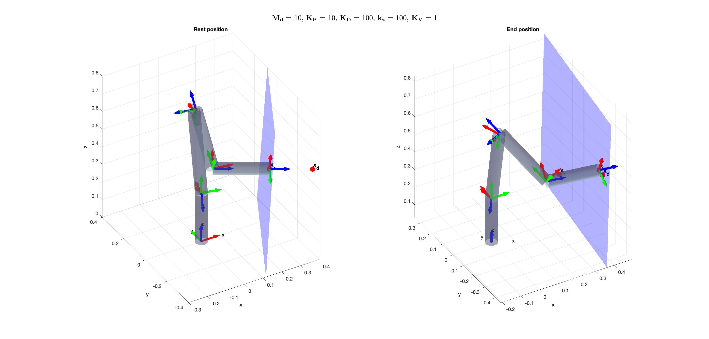

# Jaco2 position, orientation and force control
Position and orientation control with quaternions using pseudoinverse jacobian algorithm. Interaction control using Impedance control.
This document is part of the material of the robotics classes for the several master courses at the University of Cassino, downloaded from: http://webuser.unicas.it/lai/robotica/index.php/software/

# Requirements

- coppeliaSim

# Tasks
Four tasks are implemented:

1. The control objective is the position-only without exploiting the redundancy. The required path is a vertical square lying on the yz axis with side of 15 cm length. The end-effector occupies the lower-left corner of the square looking from the x axis. Each side needs to be executed with a trajectory of duration 3 s and a trapezoidal velocity profile characterized by a proper cruise velocity. The robots stops for 500 ms at each corner and 2 s once back in the initial end effector position.

      

2. In a second run, the control objective is given by both position and orientation. While the position needs to move according to the indications above, the orientation needs to be controlled such that it is kept constant at the initial value.

      

3. In a third run the end-effector orientation needs to be changed such that, when running the first side, it is rotated
of 45◦ around the z
the second side the inverse rotation is commanded such that, in the second corner, the orientation is equal to the initial one. During the third and fourth sides the orientation movement is repeated and, in the end, the final orientation is equal to the initial one.

      

4. Finally, interaction with the environment needs to be considered by assuming that the robot, in the home config- uration, is in contact with a plane with a stiffness of 102 N/m along zee at the initial configuration. An impedance controller needs to be designed and validated.

      

# File organization

The repository contains all the files that define the dynamic model of the Jaco2 robotic arm and the necessary functions to perform position, orientation and force control with the end effector.

The starting points of the tasks are:

- **main01.m** to **main09.m**: increasing exercise about the main topics of position and orientation control.
- **main_progetto_1.m** to **main_progetto_4.m**: the four main points of the project.

# How to run it
1.	Download the coppeliaSim educational version for the own O.S. from the website: http://www.coppeliarobotics.com
2.	Locate the Coppelia subfolder
3.	~/programming/remoteAPIBindings/matlab/matlab 
4.	and copy the files into your working folder
5.	Do the same with the library in the Coppelia subfolder
6.	~/programming/remoteApiBindings/lib/lib (you can find a .dll, .dylib or .so file according to your O.S. and 32/64 bit)
7.	Launch coppeliaSim (in Linux type ./coppeliaSim.sh from shell).  The program automatically runs as server on the door 19997
8.	Drag any robot from the left menu on the empty scene
9.	Run Matlab and launch the script SimpleTest.m. The program should read the number of objects present in the V-REP scene and it should end. If it does not work, check line 17 and change port 19999 to 19997, or, launch the following row from the coppeliaSim input bar at the bottom:
*simRemoteApi.start(19997)* or *simRemoteApi.start(19999)* based on the port number specified into the script.
10. In Coppelia go to *File*, then *Open scene* and select any file .ttt from the folder /vrepScene (it is simply the default scene with the chosen robot model where the pre-existent LUA script has been deleted)
11. Launch main_template.m on MATLAB. The robot should perform sinusoidal trajectories in the joint space. This is a check to ensure that the MATLAB and Coppelia connection is working

Now you can launch any .m file related to the task implemented and see the results on the 3D model.

